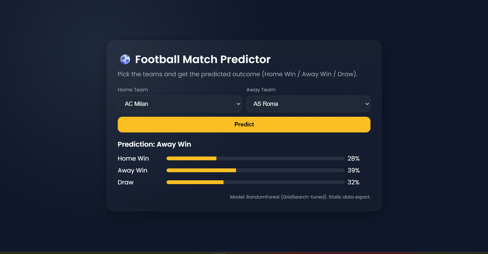

# ⚽ Football Match Predictor

A machine learning–powered web app that predicts the outcome of football matches (Home Win / Away Win / Draw) based on historical team performance data.

 <!-- replace with your screenshot path -->

---

## 🚀 Features
- Select **Home** and **Away** teams from a dropdown list  
- Get predicted outcome with probabilities:
  - 🏠 Home Win
  - 🚩 Away Win
  - 🤝 Draw
- Interactive UI with probability bars  
- Backend served via Flask API  

---

## 🛠️ Tech Stack
- **Python** (Flask, Pandas, NumPy)  
- **Scikit-learn** (RandomForest Classifier with GridSearch tuning)  
- **Frontend**: HTML, CSS, JavaScript  
- **Data**: Historical team performance statistics (CSV + JSON)  

---

## 📂 Project Structure
```
football-predictor/
├── Backend/
│   ├── model/
│   │   ├── FootballPrediction.pkl  # Trained ML model
│   │   ├── feature_columns.json    # Model feature schema
│   │   └── team_profiles.json      # Team statistical profiles
│   ├── templates/
│   │   └── index.html              # Frontend UI
│   ├── app.py                      # Flask backend + API routes
├── training/
│   ├── fixtures.csv                # Match metadata (teams, venues, etc.)
│   ├── teamStats.csv               # Team statistics
│   ├── teams.csv                   # Team metadata (names, logos, etc.)
│   └── Notebook 2.ipynb            # Training notebook
├── README.md                       # Project documentation
└── requirements.txt                # Python dependencies
```
---

## ⚡ How It Works
1. **Training**  
   - Features extracted from team match history  
   - RandomForest trained & tuned with GridSearch  
   - Model + feature schema exported  

2. **Prediction**  
   - User selects Home & Away teams  
   - Flask API loads team profiles → builds feature vector  
   - Model predicts outcome + probabilities  

---
